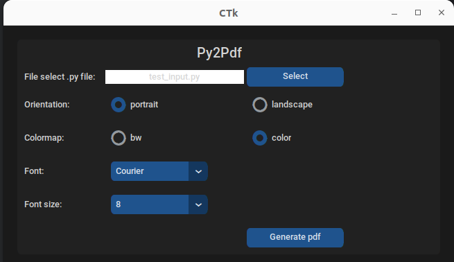

# Py2Pdf: Python Code to PDF Converter 

This Python script converts Python code (.py files) to PDF files with syntax highlighting using enscript and ps2pdf. It displays an easy to use GUI implemented using customtkinter 




The pdf options you can specify are:
- the page orientation (portrait or landscape)
- the font name and size
- the code color palette:  b/w or color

Please refer to https://linux.die.net/man/1/enscript for the complete list of esnscript arguments

## Prerequisites

- [enscript](https://www.gnu.org/software/enscript/): A command-line tool to convert text files to PostScript, which is then used to generate the PDF.
- [ps2pdf](https://www.ghostscript.com/doc/current/Ps2pdf.htm): A tool that comes with Ghostscript to convert PostScript files to PDF.
- [customtkinter](...): A modern and customizable python UI-library based on Tkinter https://github.com/TomSchimansky/CustomTkinter
- Python 3.x

## Installation

Make sure you have enscript and ps2pdf installed on your system. Install the required Python libraries by running:

```bash
pip3 install fpdf
pip3 install customtkinter
```

## Usage
git clone https://github.com/foiegreis/Py2pdf.git

cd Py2pdf

## Run

```bash
python3 py2pdf.py
```

## License
This project is licensed under the MIT License - see the LICENSE file for details.

## Acknowledgments
The script uses the fpdf library for PDF generation.

Syntax highlighting is performed using the enscript library.
